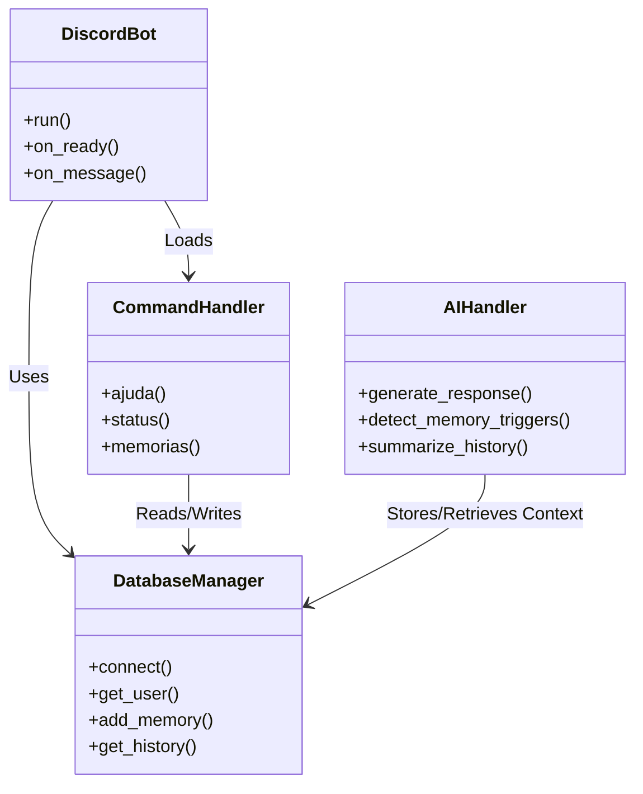

# Arquitetura do Sistema

Este documento descreve a estrutura técnica do projeto utilizando diagramas UML (Mermaid) para ilustrar os componentes e fluxos.

## 1. Visão Geral (Diagrama de Classes)

O sistema é dividido em três camadas principais: **Core**, **Modules** e **Data**.

## 2. Estrutura de Pastas e Componentes

### **Core (`bot_discord/core/`)**
*   **`bot.py`**: Ponto de entrada. Gerencia eventos do Discord e carrega extensões.
*   **`database.py`**: Abstração do SQLite (`aiosqlite`). Gerencia todas as queries e conexões.
*   **`llm_provider.py`**: Cliente para API do LM Studio.

### **Modules (`bot_discord/modules/`)**
*   **`ai_handler.py`**: Lógica de "cérebro". Monta o prompt, chama o LLM, extrai memórias e sentimentos.
*   **`commands.py`**: Comandos de texto (`!ajuda`, `!status`, etc.).

### **Data (`bot_discord/data/`)**
*   **`bot_database.db`**: Arquivo SQLite contendo tabelas de usuários, histórico e memórias.
*   **`models/`**: Pasta onde residem os modelos `.gguf`.

## 3. Integrações Externas

*   **LM Studio (Local API)**: O sistema se comunica via HTTP (localhost:1234) para inferência de texto.
*   **Discord Gateway**: Websocket para eventos de tempo real e mensagens.
